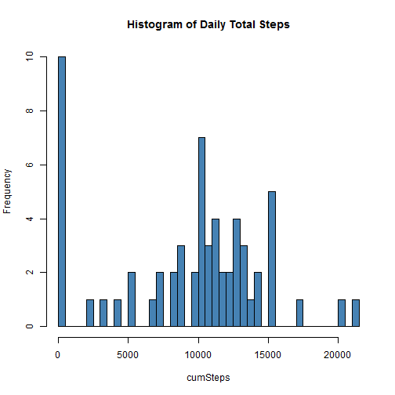
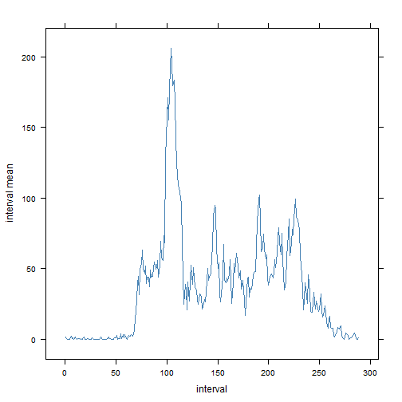
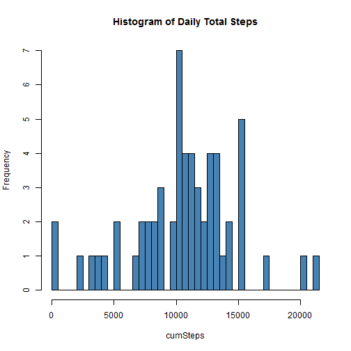
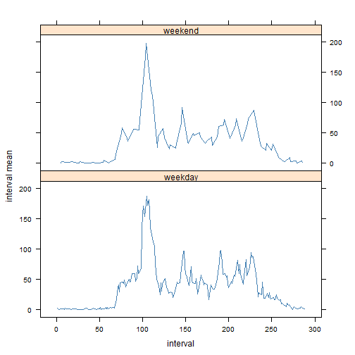

# Reproducible Research: Peer Assessment 1


## Loading and preprocessing the data
 
Unzip data archive and read file.


```r
unzip("activity.zip")
raw <- read.csv("activity.csv")
head(raw)
```

```
##   steps       date interval
## 1    NA 2012-10-01        0
## 2    NA 2012-10-01        5
## 3    NA 2012-10-01       10
## 4    NA 2012-10-01       15
## 5    NA 2012-10-01       20
## 6    NA 2012-10-01       25
```


Convert interval column from integer to character of length 4, with zeroes padded to the front.


```r
raw <- transform(raw, interval = formatC(interval, width = 4, flag = 0))
head(raw)
```

```
##   steps       date interval
## 1    NA 2012-10-01     0000
## 2    NA 2012-10-01     0005
## 3    NA 2012-10-01     0010
## 4    NA 2012-10-01     0015
## 5    NA 2012-10-01     0020
## 6    NA 2012-10-01     0025
```


Make a factor from the interval column and add as a column.


```r
raw$interval.factor <- as.factor(raw$interval)
head(raw)
```

```
##   steps       date interval interval.factor
## 1    NA 2012-10-01     0000            0000
## 2    NA 2012-10-01     0005            0005
## 3    NA 2012-10-01     0010            0010
## 4    NA 2012-10-01     0015            0015
## 5    NA 2012-10-01     0020            0020
## 6    NA 2012-10-01     0025            0025
```


Add a column that simplifies and represents the timestamp of the observations.


```r
raw$timestamp <- strptime(with(raw, paste(date, interval, sep = " ")), "%Y-%m-%d %H%M")
head(raw)
```

```
##   steps       date interval interval.factor           timestamp
## 1    NA 2012-10-01     0000            0000 2012-10-01 00:00:00
## 2    NA 2012-10-01     0005            0005 2012-10-01 00:05:00
## 3    NA 2012-10-01     0010            0010 2012-10-01 00:10:00
## 4    NA 2012-10-01     0015            0015 2012-10-01 00:15:00
## 5    NA 2012-10-01     0020            0020 2012-10-01 00:20:00
## 6    NA 2012-10-01     0025            0025 2012-10-01 00:25:00
```


## What is mean total number of steps taken per day?

Show a histogram of daily total steps.


```r
cumSteps <- tapply(raw$steps, raw$date, sum, na.rm = TRUE)
hist(cumSteps, breaks = 53, col = "steelblue", main = "Histogram of Daily Total Steps")
```

 


Calculate the mean and median daily total steps, still ignoring missing values.


```r
theSummary <- summary(cumSteps)
```


Total daily steps:
 - mean: 9350
 - median: 10400

## What is the average daily activity pattern?

Now let's look at averages for particular intervals of the day to see, on average, how active the user is at different times of day.


```r
intervalMean <- tapply(raw$steps, raw$interval.factor, mean, na.rm = TRUE)
head(intervalMean)
```

```
##  0000  0005  0010  0015  0020  0025 
## 1.717 0.340 0.132 0.151 0.075 2.094
```

```r
result <- require(lattice)
```

```
## Loading required package: lattice
```

```r
if (result == FALSE) {
    install.packages("lattice")
    library(lattice)
}
xyplot(intervalMean ~ sort(unique(unclass(raw$interval.factor))), type = "l", 
    col = "steelblue", xlab = "interval", ylab = "interval mean")
```

 


Determine the 5-minute interval with the highest average total steps.


```r
maxIntervals <- intervalMean[abs(intervalMean - max(intervalMean)) < 1]
names(maxIntervals)
```

```
## [1] "0835"
```


## Imputing missing values

Calculate the total number of rows with missing entries.


```r
length(which(!complete.cases(raw$steps, raw$date, raw$interval, raw$interval.factor, 
    raw$timestamp)))
```

```
## [1] 2304
```


Specifically notice that only the steps variable has missing values.


```r
any(is.na(raw$date))
```

```
## [1] FALSE
```

```r
any(is.na(raw$interval))
```

```
## [1] FALSE
```

```r
any(is.na(raw$timestamp))
```

```
## [1] FALSE
```

```r
any(is.na(raw$steps))
```

```
## [1] TRUE
```


Devise a strategy for filling in missing values.

Are missing values only through whole days, or do some days have partially missing values?


```r
naStatus <- tapply(raw$steps, raw$date, is.na)
allWhole <- TRUE
for (name in names(naStatus)) {
    allTest <- TRUE
    if (!all(naStatus[[name]]) && !all(!naStatus[[name]])) {
        allWhole <- FALSE
        break
    }
}
if (allWhole == TRUE) {
    print("Missing values only exist on days that have no values.")
} else {
    print("Some days with values also have missing values.")
}
```

```
## [1] "Missing values only exist on days that have no values."
```


Are the missing days interspersed amongst tracked days, or do they lie only on the outsides?


```r
naStatus <- tapply(raw$steps, raw$date, is.na)
dayMissing = logical()
for (name in names(naStatus)) {
    dayMissing <- c(dayMissing, any(naStatus[[name]]))
}
dayMissing
```

```
##  [1]  TRUE FALSE FALSE FALSE FALSE FALSE FALSE  TRUE FALSE FALSE FALSE
## [12] FALSE FALSE FALSE FALSE FALSE FALSE FALSE FALSE FALSE FALSE FALSE
## [23] FALSE FALSE FALSE FALSE FALSE FALSE FALSE FALSE FALSE  TRUE FALSE
## [34] FALSE  TRUE FALSE FALSE FALSE FALSE  TRUE  TRUE FALSE FALSE FALSE
## [45]  TRUE FALSE FALSE FALSE FALSE FALSE FALSE FALSE FALSE FALSE FALSE
## [56] FALSE FALSE FALSE FALSE FALSE  TRUE
```

```r
firstTrue <- FALSE
falsePastTrue <- FALSE
secondTrue <- FALSE
tailsMissingOnly <- TRUE
for (entry in dayMissing) {
    if (firstTrue == FALSE) {
        if (entry == TRUE) {
            firstTrue <- TRUE
        }
    } else if (falsePastTrue == FALSE) {
        if (entry == FALSE) {
            falsePastTrue <- TRUE
        }
    } else if (secondTrue == FALSE) {
        if (entry == TRUE) {
            tailsMissingOnly <- FALSE
        }
    }
}
if (tailsMissingOnly) {
    print("Missing days are only the outermost days of the set.")
} else print("Missing days are interspersed with tracked days.")
```

```
## [1] "Missing days are interspersed with tracked days."
```


My strategy for filling in missing values is to:
 - ignore the first and last day which are missing and treat the data set as though it was taken over a window shorter by two days
 - set a missing value to be equal to the average of the same interval in the closest available previous and next day's interval of the same time
 
Create a second dataset that has the filled in missing values.


```r
dayList <- split(raw, raw$date)
toFill <- dayList
for (index in 2:(length(dayMissing) - 1)) {
    if (dayMissing[[index]] == TRUE) {
        # day is missing
        priorIndex <- NULL
        nextIndex <- NULL
        bookmark <- index
        while (is.null(priorIndex)) {
            bookmark <- bookmark - 1
            if (dayMissing[[bookmark]] == FALSE) {
                priorIndex <- bookmark
            }
        }
        bookmark <- index
        while (is.null(nextIndex)) {
            bookmark <- bookmark + 1
            if (dayMissing[[bookmark]] == FALSE) {
                nextIndex <- bookmark
            }
        }
        interpolationSet <- cbind(dayList[[priorIndex]]$steps, dayList[[index]]$steps, 
            dayList[[nextIndex]]$steps)
        interpolationSet[, 2] <- rowMeans(interpolationSet[, c(1, 3)])
        toFill[[index]]$steps <- interpolationSet[, 2]
    }
}
rm(dayList)
filled <- NULL

# iterate through list and bind to a dataframe
for (i in 2:(length(toFill) - 1)) {
    if (is.null(filled)) {
        filled <- toFill[[i]]
    } else {
        filled <- rbind(filled, toFill[[i]])
    }
}

rm(toFill)
summary(filled)
```

```
##      steps             date         interval         interval.factor
##  Min.   :  0   2012-10-02:  288   Length:16992       0000   :   59  
##  1st Qu.:  0   2012-10-03:  288   Class :character   0005   :   59  
##  Median :  0   2012-10-04:  288   Mode  :character   0010   :   59  
##  Mean   : 37   2012-10-05:  288                      0015   :   59  
##  3rd Qu.: 15   2012-10-06:  288                      0020   :   59  
##  Max.   :806   2012-10-07:  288                      0025   :   59  
##                (Other)   :15264                      (Other):16638  
##    timestamp                  
##  Min.   :2012-10-02 00:00:00  
##  1st Qu.:2012-10-16 17:58:45  
##  Median :2012-10-31 11:57:30  
##  Mean   :2012-10-31 12:23:53  
##  3rd Qu.:2012-11-15 05:56:15  
##  Max.   :2012-11-29 23:55:00  
## 
```


How did filling in missing values affect daily total steps?

Show a histogram of daily total steps.


```r
cumSteps <- tapply(filled$steps, filled$date, sum, na.rm = FALSE)
hist(cumSteps, breaks = 53, col = "steelblue", main = "Histogram of Daily Total Steps")
```

 


Calculate the mean and median daily total steps, still ignoring missing values.


```r
theSummary <- summary(cumSteps)
```


Total daily steps:
 - mean: 10600
 - median: 10600

These values are higher with additional data, as expected, but additional they appear much more normal, with the mean equal to the median.

## Are there differences in activity patterns between weekdays and weekends?


```r
weekdays(filled[1, "timestamp"])
```

```
## [1] "Tuesday"
```


The first tracked day is a Tuesday.

Factor observations into weekdays and weekends.


```r
# starting with Tuesday is 4 weekdays, two weekends, and final the weekday
# of Monday
weekpart <- factor(c(rep("weekday", 4), rep("weekend", 2), "weekday"))
weekpart <- rep(weekpart, nrow(filled)/7 + 1)
filled$weekpart <- weekpart[1:nrow(filled)]
head(filled)
```

```
##     steps       date interval interval.factor           timestamp weekpart
## 289     0 2012-10-02     0000            0000 2012-10-02 00:00:00  weekday
## 290     0 2012-10-02     0005            0005 2012-10-02 00:05:00  weekday
## 291     0 2012-10-02     0010            0010 2012-10-02 00:10:00  weekday
## 292     0 2012-10-02     0015            0015 2012-10-02 00:15:00  weekday
## 293     0 2012-10-02     0020            0020 2012-10-02 00:20:00  weekend
## 294     0 2012-10-02     0025            0025 2012-10-02 00:25:00  weekend
```


Compare interval averages separated by type of type.


```r
intervalMean <- tapply(filled$steps, filled$interval.factor, mean, na.rm = FALSE)
xyplot(intervalMean ~ sort(unique(unclass(filled$interval.factor))) | filled$weekpart, 
    type = "l", col = "steelblue", xlab = "interval", ylab = "interval mean", 
    layout = c(1, 2))
```

 


Activity levels are fairly consistent regardless of day type.
